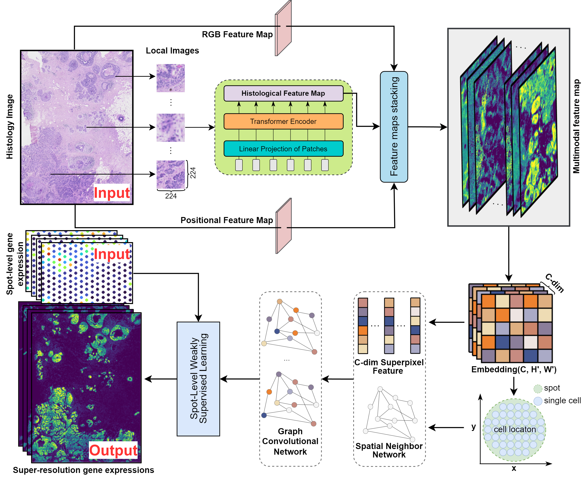

# srstGCN
## Overview
srstGCN is a GCN-based method that leverages a weakly supervised learning framework to integrate multimodal information and then infer super-resolution gene expression at single-cell level. It first extract high-resolution multimodal feature map, including histological feature map, positional feature map, and RGB feature map. and then use the GCN module to predict super-resolution gene expression from multimodal feature map by a weakly supervised framework. srstGCN can predict super-resolution gene expression accurately, aid researchers in discovering biologically meaningful differentially expressed genes and pathways. Additionally, it can predict expression both outside the spots and in external tissue sections.

